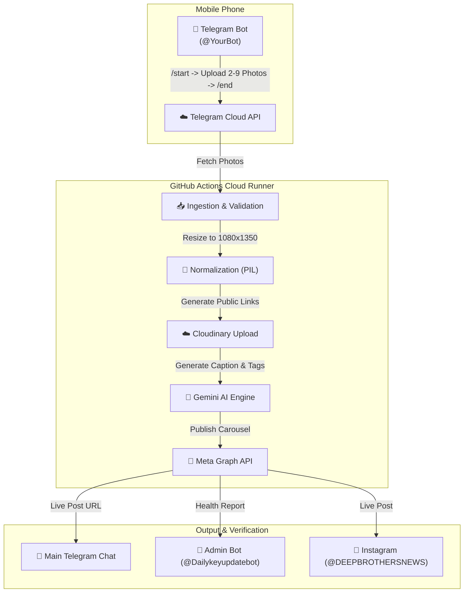

# 🚀 Autonomous Instagram Carousel Pipeline (`Happydemo`)
## Client Presentation Guide & Operating Manual

---

### 🌐 GitHub Repository Links (`Happydemo`)
- 🏠 **GitHub Repository:** [github.com/ms3593589-beep/Happydemo](https://github.com/ms3593589-beep/Happydemo)
- ⚡ **GitHub Actions Workflow:** [github.com/ms3593589-beep/Happydemo/actions/workflows/post.yml](https://github.com/ms3593589-beep/Happydemo/actions/workflows/post.yml)
- 🔑 **GitHub Actions Secrets:** [github.com/ms3593589-beep/Happydemo/settings/secrets/actions](https://github.com/ms3593589-beep/Happydemo/settings/secrets/actions)

---

## 📌 PART 1: How to Explain This Project to Your Client

### 1. Elevator Pitch (What to Say)
> *"We have built a fully automated, cloud-hosted content publishing engine for `@DEEPBROTHERSNEWS`. Whenever you have raw photos from an event, product, or news story, you simply drop 2 to 9 photos into Telegram on your mobile phone. Our cloud system on GitHub Actions takes over: it normalizes your images to professional Instagram dimensions, crafts an optimized caption with hashtags using Google Gemini AI, uploads everything securely, and publishes a live Instagram Carousel post—sending you the live post URL in seconds."*

---

### 2. Key Selling Points (Value Proposition)

| Feature | Client Benefit |
| :--- | :--- |
| **📱 100% Mobile Workflow** | No need to log into Instagram or transfer files to a PC. Just upload photos via Telegram on your phone. |
| **🎨 100% Clean Image Quality** | Preserves 100% of raw image quality without forced text overlays or image degradation. |
| **🤖 Gemini AI Captions** | Automatically writes engaging headlines, body text, and high-reach hashtags for maximum algorithm reach. |
| **☁️ Zero Server Cost** | Runs 100% free and serverless on **GitHub Actions** infrastructure. |
| **🔔 Dual Telegram Telemetry** | Sends the live Instagram link to the main chat and detailed health/performance metrics to `@Dailykeyupdatebot`. |

---

### 3. Visual Workflow Architecture



---

## 📖 PART 2: Step-by-Step Manual to Re-Run GitHub Actions

Whenever you want to publish a new post, follow these **3 simple steps**:

---

### 📲 Step 1: Upload Photos on Telegram (Mobile Phone)
1. Open your Telegram app on your phone.
2. Open the chat with your bot (`@YourBot`).
3. Send the command: `/start`  
   *(This clears old buffer and starts a clean session)*
4. Attach and send **2 to 9 raw photos**.
5. Send the command: `/end`  
   *(This locks the photo batch for processing)*

---

### 🖥️ Step 2: Trigger Workflow on GitHub (Laptop / Browser)
1. Open your repository actions page:  
   👉 **[github.com/ms3593589-beep/Happydemo/actions/workflows/post.yml](https://github.com/ms3593589-beep/Happydemo/actions/workflows/post.yml)**
2. Click the **`Run workflow`** dropdown button on the right side.
3. Keep `🚀 LIVE PUBLISH TO INSTAGRAM` checked.
4. Click the green **`Run workflow`** button!

---

### ✅ Step 3: Check Your Live Instagram Post
Within **60 to 90 seconds**:
- **Main Telegram Chat:** Receives your live Instagram link: `https://www.instagram.com/p/...`
- **Admin Telegram Bot (`@Dailykeyupdatebot`):** Receives the execution health report (`✅ SUCCESS`, execution duration, and slide count).

---

## 💻 PART 3: Complete Command Reference & Cheatsheet

### 1. Telegram Bot Commands

| Command | Purpose |
| :--- | :--- |
| `/start` | Resets the photo buffer and clears temporary cache. |
| **Attach 2–9 Photos** | Buffers raw images for carousel slides. |
| `/end` | Finalizes batch and marks status as `active`. |

---

### 2. Local Terminal Commands (For Testing on Laptop)

```bash
# Test full pipeline locally in Dry-Run mode (No Instagram posting)
python pipeline.py --dry-run

# Run live execution locally from your PC terminal
python pipeline.py

# Run unit test suite (Verifies all 34 core modules)
python -m unittest discover tests
```

---

### 3. Git Repository Sync Commands

```bash
# Check git status
git status

# Push new changes to Happydemo repository
git add .
git commit -m "update: pipeline enhancements"
git push origin main
```

---

## 🔑 PART 4: Environment Secrets Reference (`Happydemo`)

These 8 secrets are configured under **Settings** → **Secrets and variables** → **Actions**:

| Secret Name | Description |
| :--- | :--- |
| `GEMINI_API_KEY` | Google Gemini AI key for caption & hashtag generation. |
| `TELEGRAM_BOT_TOKEN` | Token for main Telegram photo receiver bot. |
| `TELEGRAM_CHAT_ID` | Telegram Chat ID for post links. |
| `TELEGRAM_ADMIN_BOT_TOKEN` | Token for `@Dailykeyupdatebot` admin alerts. |
| `TELEGRAM_ADMIN_CHAT_ID` | Telegram Chat ID for admin health reports. |
| `CLOUDINARY_URL` | Cloudinary storage URL for public HTTPS image URLs. |
| `IG_USER_ID` | Instagram Professional Account User ID (`17841422784863270`). |
| `IG_ACCESS_TOKEN` | Long-Lived Meta Graph API access token. |

---

*Document compiled for brand `@DEEPBROTHERSNEWS` | Project: Happydemo*
